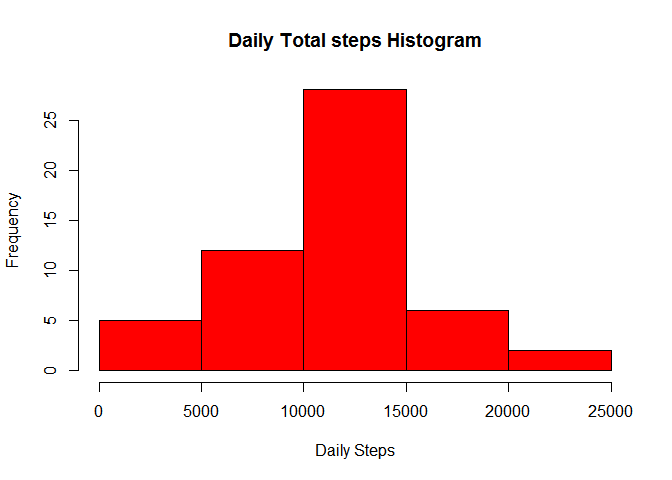
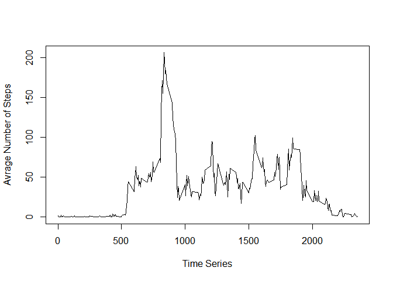
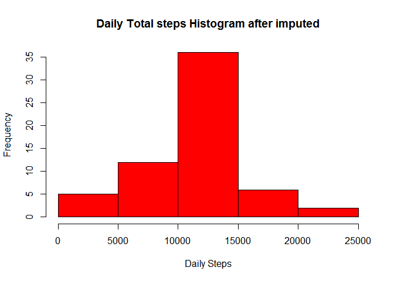
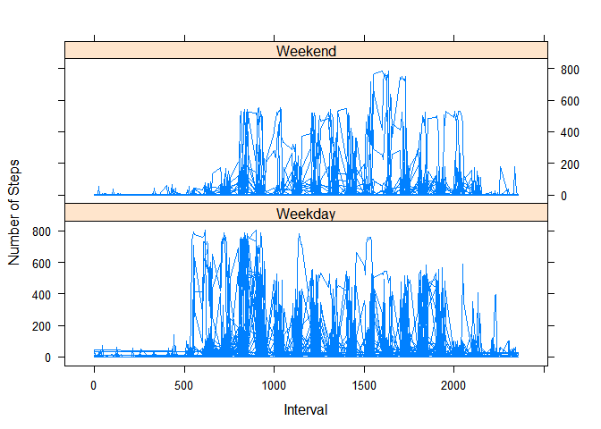

1. Lets Read the file
=====================

    ActivDF <- read.csv('activity.csv')

Load the dplyr library
----------------------

and prepare the summary data
----------------------------

    library(dplyr)

    ## 
    ## Attaching package: 'dplyr'

    ## The following objects are masked from 'package:stats':
    ## 
    ##     filter, lag

    ## The following objects are masked from 'package:base':
    ## 
    ##     intersect, setdiff, setequal, union

    data_summary <- ActivDF[!is.na(ActivDF$steps),c("date","steps")] %>% 
    group_by(date) %>%
    summarise_each(funs(sum))

2.Histogram of the total number of steps taken each day
-------------------------------------------------------

    hist(data_summary$steps,col="red",main="Daily Total steps Histogram",xlab="Daily Steps")

<!-- -->

3.Mean and median number of steps taken each day
------------------------------------------------

    data_summary2 <- ActivDF[!is.na(ActivDF$steps),c("date","steps")] %>% 
    group_by(date) %>%
    summarise_each(funs(mean))

    print(data_summary2)

    ## Source: local data frame [53 x 2]
    ## 
    ##          date    steps
    ##        (fctr)    (dbl)
    ## 1  2012-10-02  0.43750
    ## 2  2012-10-03 39.41667
    ## 3  2012-10-04 42.06944
    ## 4  2012-10-05 46.15972
    ## 5  2012-10-06 53.54167
    ## 6  2012-10-07 38.24653
    ## 7  2012-10-09 44.48264
    ## 8  2012-10-10 34.37500
    ## 9  2012-10-11 35.77778
    ## 10 2012-10-12 60.35417
    ## ..        ...      ...

    data_summary3 <- ActivDF[!is.na(ActivDF$steps),c("date","steps")] %>% 
    group_by(date) %>%
    summarise_each(funs(median))

    print(data_summary3)

    ## Source: local data frame [53 x 2]
    ## 
    ##          date steps
    ##        (fctr) (dbl)
    ## 1  2012-10-02     0
    ## 2  2012-10-03     0
    ## 3  2012-10-04     0
    ## 4  2012-10-05     0
    ## 5  2012-10-06     0
    ## 6  2012-10-07     0
    ## 7  2012-10-09     0
    ## 8  2012-10-10     0
    ## 9  2012-10-11     0
    ## 10 2012-10-12     0
    ## ..        ...   ...

4.Time series plot of the average number of steps taken
-------------------------------------------------------

    data_summary4 <- ActivDF[!is.na(ActivDF$steps),c("interval","steps")] %>% 
    group_by(interval) %>%
    summarise_each(funs(mean))

    plot(data_summary4$interval, data_summary4$steps,xlab="Time Series",ylab="Avrage Number of Steps", type = "l")

<!-- -->

5.The 5-minute interval that, on average, contains the maximum number of steps
------------------------------------------------------------------------------

    data_summary4[data_summary4$steps == max(data_summary4$steps),]

    ## Source: local data frame [1 x 2]
    ## 
    ##   interval    steps
    ##      (int)    (dbl)
    ## 1      835 206.1698

6.Code to describe and show a strategy for imputing missing data
----------------------------------------------------------------

    ## assign average of the number of steps for the missing interval
    ADF <- ActivDF 

    for (interval in data_summary4$interval) 
    {
        ADF[is.na(ADF$steps) & ADF$interval == interval   ,1] <- data_summary4[data_summary4$interval==interval,2]
    }

7.Histogram of the total number of steps taken each day after missing values are imputed
----------------------------------------------------------------------------------------

    data_summary5 <- ADF[!is.na(ADF$steps),c("date","steps")] %>% 
    group_by(date) %>%
    summarise_each(funs(sum))

    hist(data_summary5$steps,col="red",main="Daily Total steps Histogram after imputed",xlab="Daily Steps")

<!-- -->

8.Panel plot comparing the average number of steps taken per 5-minute interval across weekdays and weekends
-----------------------------------------------------------------------------------------------------------

    ADF[,4] <- format(as.Date(ADF$date),"%w")
    ADF[ADF$V4 %in% c("1","2","3","4","5"),4] <- "Weekday"
    ADF[ADF$V4 %in% c("0","6"),4] <- "Weekend"
    names(ADF)[4] <- "DayOfWeek"

    library (lattice)

    xyplot(steps~interval|factor(DayOfWeek),
           data = ADF,
           type='l',layout=c(1,2),
           xlab='Interval',ylab='Number of Steps')

<!-- -->

9.All of the R code needed to reproduce the results (numbers, plots, etc.) in the report
----------------------------------------------------------------------------------------
